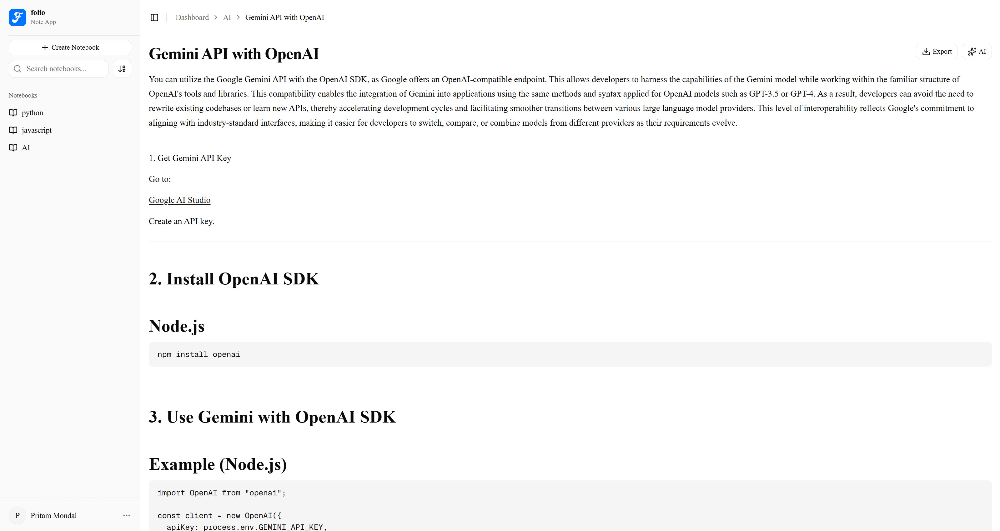

<div align="center">

<h1> folio</h1>

**The note app for thinking, drafting, and shipping.**

A focused editor with a built-in AI assistant. Capture ideas, refine them in place, and export to PDF, Word, Markdown, HTML, or plain text — free, open source, and yours to extend.

[](https://opensource.org/licenses/MIT)
[](https://nextjs.org)
[](https://www.typescriptlang.org)

[Live demo](https://github.com/Arijit-mondal099/folio) · [Documentation](./docs/README.md) · [Report a bug](https://github.com/Arijit-mondal099/folio/issues)

</div>

<br />

<p align="center">
  
</p>

## What is folio?

Folio is a free, open-source note-taking app built around three ideas: a clean writing surface, an AI assistant you control, and zero vendor lock-in. Group notes into notebooks, refine any passage with inline AI transforms, ask the chat sidebar to draft a section for you (with a review-and-apply flow that never overwrites your work), then export the result to whichever format you need.

It's built with the modern Next.js App Router on top of Postgres and runs on free tiers everywhere — or in a single Docker container on your own server.

## Features

- **Notebooks and notes** — Group related notes. Search, sort, and jump to anything in seconds.
- **AI writing assistant** — A streaming chat sidebar that drafts, rewrites, and extends — every change passes through your review before it lands.
- **Inline transforms** — Highlight any text to fix typos, sharpen clarity, summarise, shift tone, or translate. No round-trips.
- **Multi-format export** — Markdown, HTML, plain text, PDF, and Word. Formatting preserved, no lock-in.
- **Activity dashboard** — Notes per notebook, recent writing activity, and your most-used notebook at a glance.
- **Dark mode** — Light or dark, follows your system preference, with no flash on first paint.

## Tech stack

| Layer        | Choice                                                 |
| ------------ | ------------------------------------------------------ |
| Framework    | Next.js 16 (App Router, React 19)                      |
| Language     | TypeScript                                             |
| Styling      | Tailwind CSS v4 + shadcn/ui + Radix                    |
| Editor       | TipTap v3 (StarterKit + Link, TaskList, Typography)    |
| State / data | TanStack Query, react-hook-form + Zod                  |
| Database     | Drizzle ORM + Neon Postgres                            |
| Auth         | better-auth (email/password + Google OAuth)            |
| AI           | Groq (qwen3-32b) via the OpenAI SDK                    |
| Email        | Resend + React Email templates                         |
| Charts       | Recharts                                               |
| Tooling      | pnpm, ESLint, Prettier, Husky, lint-staged, commitlint |

## Quick start

```bash
git clone https://github.com/Arijit-mondal099/folio.git
cd folio
cp .env.example .env        # fill in the values (see docs/configuration.md)
pnpm install
pnpm db:push                # apply the schema to your Postgres
pnpm dev
```

Open [http://localhost:3000](http://localhost:3000). The full setup walkthrough — including where to get each API key — lives in [docs/getting-started.md](./docs/getting-started.md).

## Documentation

| Guide                                        | What it covers                                |
| -------------------------------------------- | --------------------------------------------- |
| [Getting started](./docs/getting-started.md) | Prereqs, install, env, first sign-in          |
| [Configuration](./docs/configuration.md)     | Every env variable: what, why, where to get   |
| [Development](./docs/development.md)         | Scripts, db commands, lint/commit conventions |
| [Deployment](./docs/deployment.md)           | Vercel, Docker, self-host on a VPS            |
| [Architecture](./docs/architecture.md)       | Folder map, auth flow, AI flow, theming       |

## Contributing

Issues and PRs are welcome. Open an [issue](https://github.com/Arijit-mondal099/folio/issues) before starting work on anything non-trivial so we can talk through the approach. The [development guide](./docs/development.md) covers the basics — commit conventions, code style, and the test/lint commands you'll want to run before pushing.

## License

MIT. See the GitHub repository for the full text.
